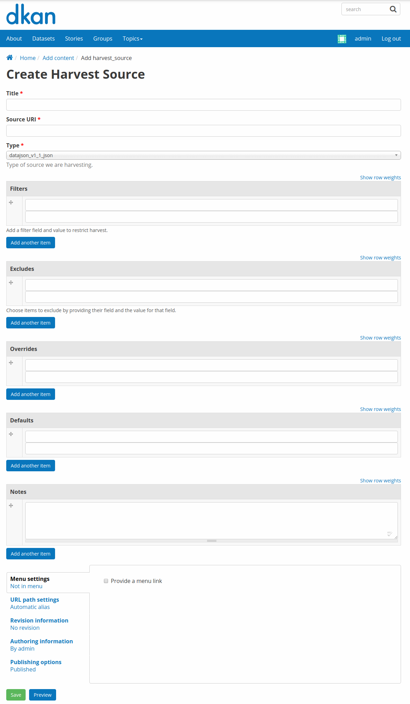
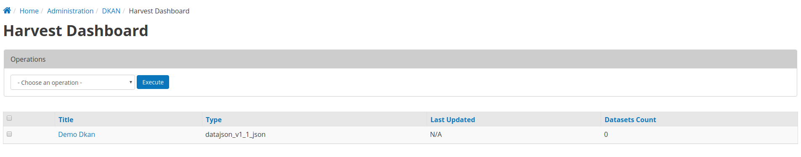
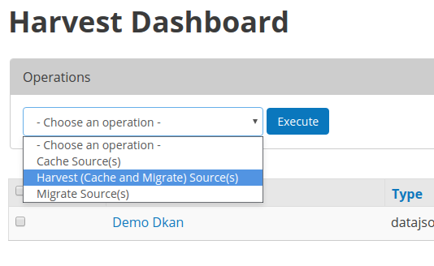

DKAN Harvest is a module that provides a common harvesting framework for Dkan
extensions and adds a CLI and a WUI to DKAn to manage harvesting sources and
jobs.

### What do you mean by `harvest open data`?

Grab open data from the web and create [DKAN's](http://nucivic.com/dkan)
datasets and resources from it.

### How does it works?

It saves the subscribed data locally to files in `drupal's public:// folder`.
Then it runs a migration that creates the `dataset` and `resource` DKAN nodes.

## Usage
### Add a Harvest Source

Harvest Sources are available as content of type `harvest-source`. The easiest
way, as an admin, to add a new harvest source node is to go to
`node/add/harvest-source` and fill the form.



If the Harvest Source type you are looking for is not available, please refer
to the **Define a new Harvest Source Type** section in the developers docs.

### Run a Harvest from the Dashboard

To run and manage harvest operations from the Web interface one can use the
Dashboard available via `admin/dkan/harvest/dashboard`. This is a view of all
available (added and published) harvest sources in the system. Apart from the
title and the type additonal columns displaying the last time a harvest
migration was run for a specific harvest source and the number of datsets
imported are available.



To run a full harvest operation or a harvest cache operation or a harvest
migration operation, select all or a number of harvest sources listed in the
dashboard and select a task from the **Operations** dropdown.



### Drush

DKAN Harvest provides multiple drush commands to manage harvest sources and
control harvest jobs. It is recommanded to pass the `--user=1` drush option to
harvest operation (especially harvest migration jobs) to make sure that the
entities created have a proper user as author.

### List Harvest sources available

```sh
# List all available Harvest Sources
$ drush --user=1 dkan-harvest-status
# Alias
$ drush --user=1 dkan-hs
```

### Run a full harvest (Cache & Migration)

```sh
# Harvest data and run migration on all the harvest sources available.
$ drush --user=1 dkan-harvest
# Alias
$ drush --user=1 dkan-h

# Harvest specific  harvest source.
$ drush --user=1 dkan-harvest test_harvest_source
# Alias
$ drush --user=1 dkan-h test_harvest_source
```

### Run a harvest cache 

```sh
# Run a harvest cache operation on all the harvest sources available.
$ drush --user=1 dkan-harvest-cache
# Alias
$ drush --user=1 dkan-hc

# Harvest cache specific harvest source.
$ drush --user=1 dkan-harvest-cache test_harvest_source
# Alias
$ drush --user=1 dkan-hc test_harvest_source
```

### Run a harvest migration job

```sh
# Run a harvest migrate operation on all the harvest sources available.
$ drush --user=1 dkan-harvest-migrate
# Alias
$ drush --user=1 dkan-hm

# Harvest migrate specific harvest source.
$ drush --user=1 dkan-harvest-migrate test_harvest_source
# Alias
$ drush --user=1 dkan-hm test_harvest_source
```

## Developer Documentations

DKAN developers can use the api provided by DKAN Harvest to add support for
additioanl harvest source types. The `dkan_harvest_datajson` module encapsulate
the example implementation providing support for POD type sources.

If you need to harvest from an end point type other then POD. You can extend
the DKAN Harvest APIs to implement said support by following a simple
checklist:
* Define a new Harvest Source Type via `hook_harvest_source_types`.
* Implement the Harvest Source Type cache callback.
* Implement the Harvest Source Type Migration Class.
* (Optional) Write tests for your source type implementation.

### Define a new Harvest Source Type

DKAN Harvest leverage drupal's hook system to provide a way to extend the
Source types that DKAN Harvest supports. To add a new harvest source type the
we return their definitions as array items via the
`hook_harvest_source_types()` hook.

```php
/**
 * Implements hook_harvest_source_types().
 */
function dkan_harvest_test_harvest_source_types() {
  return array(
    'harvest_test_type' => array(
      'machine_name' => 'harvest_test_type',
      'label' => 'Dkan Harvest Test Type',
      'cache callback' => 'dkan_harvest_cache_default',
      'migration class' => 'HarvestMigration',
    ),

    // Define another harvest source type.
    'harvest_another_test_type' => array(
      'machine_name' => 'harvest_another_test_type',
      'label' => 'Dkan Harvest Another Test Type',
      'cache callback' => 'dkan_harvest_cache_default',
      'migration class' => 'HarvestMigration',
    ),
  );
}
```

Each array item define one single harvest source. Each harvest source item consist of an array with 4 keyed values:
* 'machine_name'
* 'label'
* 'cache callback'
* 'migration class'

#### Machine Name
Unique string identifying the harvest source type.

#### Label
This label wil be used on the harvest add node form.

#### Cache Callaback
This is the function called by the core DKAN harvest to perform a harvest cache
operation on a source with a specific type. This callback takes a HarvestSource
object and a timestamp of the harvest start time. This callback returns a
HarvestCache object which contains the result of the cache operation.

```php
/**
 * @param HarvestSource $source
 * @param $harvest_updatetime
 *
 * @return HarvestCache
 */
function dkan_harvest_datajson_cache(HarvestSource $source, $harvest_updatetime)
```

This callback takes care of downloading/filtering/altering the data from the
source end-point to the local file directory provided by the
HarvestSource::getCacheDir() method. The recommended folder structure for
cached data is to have one dataset per uniqly named file. The cache folder
directory structure is processed later during the migrate task and a lot of
curretly developed tooling was build with the one-dataset-per-file organization
in mind.

```sh
$ tree
.
├── 5251bc60-02e2-4023-a3fb-03760551ab4a
├── 80756f84-894f-4796-bb52-33dd0a54164e
├── 846158bd-1821-48d8-80c8-bb23a98294a9
└── 84cada83-2382-4ba2-b9be-97634b422a07

0 directories, 4 files

$ cat 84cada83-2382-4ba2-b9be-97634b422a07
/* JSON content of the cached dataset data */
```

The harvest cache function needs to support the source alteration condition
available from the harvest source via the `field_dkan_harvest_filters`,
`field_dkan_harvest_excludes`, `field_dkan_harvest_overrides`,
`field_dkan_harvest_defaults`fields. Each of this configuration is available
from the HarvestSource object via the `HarvestSource::filters`,
`HarvestSource::excludes`, `HarvestSource::overrides`,
`HarvestSource::defaults` methodes.

#### Migration Class

The harvest migration is encapsulated in the `HarvestMigration` class. Core
DKAN Harvest will support only migration classes extended from
`HarvestMigration`.

##### HarvestMigration::__construct()
##### HarvestMigration::setFieldMappings()
##### Resources Management

### Tests
#### PHPUnit tests

All the current PHPUnit tests for DKAN Harvest are available in the
`test/phpunit/` folder.

#### Behat tests

All the current PHPUnit tests for DKAN Harvest are available in the
`test/behat/` folder.

## Todo's

+ Move as much as possible from `DataJSONHarvest` class to **dkan_migrate_base** 's own `MigrateDataJsonDatasetBase`
+ Create drupal admin page to subscribe sources of data.
+ Better support for handling failed harvest migrations.
+ Greater Test coverage.
+ Extend drush commands.
